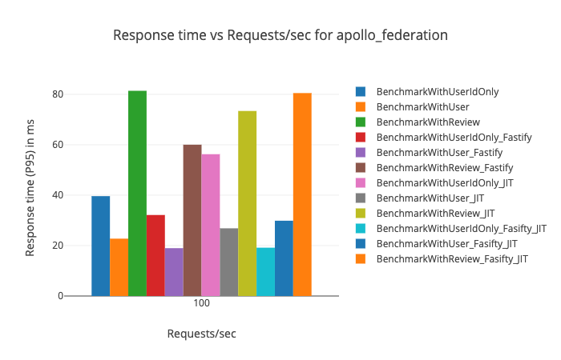

# Federation Performance Benchmarking with Fastify and GraphQL JIT

**The code in this repository is experimental and has been provided for reference purposes only. Community feedback is welcome but this project may not be supported in the same way that repositories in the official [Apollo GraphQL GitHub organization](https://github.com/apollographql) are. If you need help you can file an issue on this repository, [contact Apollo](https://www.apollographql.com/contact-sales) to talk to an expert, or create a ticket directly in Apollo Studio.**

This project presents four different Apollo Federation configurations:

1. Apollo Server with no optimizations (uses Express under the hood)
2. Apollo Server with the [Fastify integration](https://www.npmjs.com/package/apollo-server-fastify)
3. Apollo Server with [GraphQL JIT](https://github.com/zalando-incubator/graphql-jit) to compile queries
4. Apollo Server with Fastify and GraphQL JIT

These server configurations are then tested with three different queries (located in `benchmarking/queries.graphql`) for a total of 12 different candidates.

## Installation

Run the following command to install dependencies:

```sh
npm i
```

You will also need to have [Docker](https://www.docker.com/) installed and running to use [graphql-bench](https://github.com/hasura/graphql-bench).

## Usage & Rationale

Start the four different gateways with their implementing services:

```sh
npm run basic
npm run with-fastify
npm run with-jit
npm run with-fastify-and-jit
```

Then `cd` into the `benchmarking` directory and start up graphql-bench:

```sh
cat bench.yaml | docker run -i --rm -p 8050:8050 -v $(pwd)/queries.graphql:/graphql-bench/ws/queries.graphql hasura/graphql-bench:v0.3
```

If the histograms don't render properly at [http://localhost:8050](http://localhost:8050), then you may have a time synchronization issue between the host and the Docker for Mac VM. Running the following command should fix the issue:

```sh
docker run -it --privileged --pid=host justincormack/nsenter1 /bin/sh -c 'kill -9 "$(pidof sntpc)"';
```

[See this issue](https://github.com/hasura/graphql-bench/issues/2) in the graphql-bench repository for more details.

Go get a coffee and wait for the benchmarking tool to finish running. When complete, the output will be available at [http://localhost:8050](http://localhost:8050) and look like this:



## Known Limitations

List any limitations of the project here:

- Limitation 1
- Limitation 2

## Notes

Is there anything else the user should know about this project? (e.g. assumptions, prior art, references, etc.)